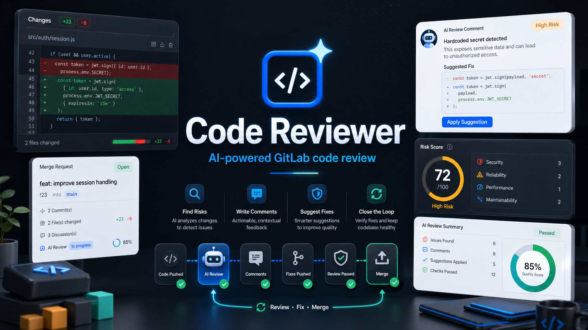

# Code Reviewer

AI-powered code review assistant for GitLab teams.

[English](#english) | [中文](#中文)

## 中文

Code Reviewer 是一个面向 GitLab 工作流的 AI 代码审查工具。它可以在代码提交或合并请求发生时自动读取变更内容，调用大模型生成审查建议，并帮助团队更快发现风险、统一审查标准、沉淀改进记录。

这个项目适合希望把 AI 引入日常代码评审流程的团队，也适合作为学习 Spring Boot、Vue 和大模型应用集成的参考项目。

### 功能亮点

- 自动接入 GitLab Webhook，支持提交和合并请求场景。
- 使用 AI 分析代码变更，输出风险、问题和改进建议。
- 支持按项目维护审查策略、模型配置和通知开关。
- 可将审查结果回写到 GitLab 评论中，方便团队在原工作流内处理。
- 支持提交、评审、修改、确认是否通过的闭环流程，让 AI 审查结果真正进入团队协作。
- 提供 Web 管理界面，用于查看项目、任务、审查记录和模型配置。
- 支持审查结果沉淀，便于复盘代码质量和团队改进趋势。

### 技术栈

- Backend: Java 8, Spring Boot, MyBatis-Plus
- Frontend: Vue 3, Vite, TypeScript, Element Plus
- Runtime: MySQL, Redis, Docker
- AI Provider: OpenAI-compatible chat completion APIs

### 快速开始

克隆项目：

```bash
git clone https://github.com/your-name/code-reviewer.git
cd code-reviewer
```

启动后端：

```bash
mvn spring-boot:run
```

启动前端：

```bash
cd web-ui
npm install
npm run dev
```

默认情况下，你需要准备可用的数据库、GitLab 访问令牌和大模型 API Key。建议通过环境变量或本地配置文件管理这些信息，不要将真实密钥提交到仓库。

### 配置说明

项目支持通过配置文件或环境变量设置运行参数，例如：

- GitLab 服务地址和访问令牌
- 大模型服务地址、模型名称和 API Key
- 数据库连接信息
- 通知和结果回写开关

仓库中只应保留示例配置。真实环境的密码、Token、Webhook URL、证书和私钥应放在本地配置、部署平台密钥或 CI/CD Secret 中。

### 文档

- [GitLab Webhook API](docs/api/gitlab-webhook.md)
- [Project API](docs/api/projects.md)
- [Dashboard API](docs/api/dashboard.md)
- [Local Development](docs/ops/local-dev.md)

### 参与贡献

欢迎提交 Issue、建议和 Pull Request。你可以从以下方向参与：

- 改进 AI 审查提示词和输出格式
- 增加更多代码托管平台支持
- 优化前端交互和审查记录展示
- 补充测试、文档和部署示例

### 许可证

本项目基于 [MIT License](LICENSE) 开源。

---

## English

Code Reviewer is an AI-powered code review assistant designed for GitLab workflows. It listens to code changes, analyzes diffs with a large language model, and helps teams discover risks, improve consistency, and keep review records in one place.

It is suitable for teams that want to bring AI into their daily review process, and it can also be used as a reference project for building Spring Boot, Vue, and LLM-integrated applications.

### Features

- Integrates with GitLab Webhooks for commits and merge requests.
- Uses AI to analyze code changes and generate actionable review suggestions.
- Supports project-level review rules, model settings, and notification options.
- Can write review results back to GitLab comments.
- Supports a closed-loop workflow from code submission to AI review, developer fixes, and final approval.
- Provides a web console for projects, review tasks, records, and model settings.
- Keeps review history for quality tracking and team improvement.

### Tech Stack

- Backend: Java 8, Spring Boot, MyBatis-Plus
- Frontend: Vue 3, Vite, TypeScript, Element Plus
- Runtime: MySQL, Redis, Docker
- AI Provider: OpenAI-compatible chat completion APIs

### Quick Start

Clone the repository:

```bash
git clone https://github.com/your-name/code-reviewer.git
cd code-reviewer
```

Start the backend:

```bash
mvn spring-boot:run
```

Start the frontend:

```bash
cd web-ui
npm install
npm run dev
```

You will need a database, a GitLab access token, and an LLM API key. Use environment variables or local configuration files for real credentials. Do not commit secrets to the repository.

### Configuration

The application can be configured with files or environment variables, including:

- GitLab URL and access token
- LLM base URL, model name, and API key
- Database connection settings
- Notification and comment-back options

Only example configuration should be committed. Real passwords, tokens, webhook URLs, certificates, and private keys should be stored locally, in deployment secrets, or in CI/CD secret stores.

### Documentation

- [GitLab Webhook API](docs/api/gitlab-webhook.md)
- [Project API](docs/api/projects.md)
- [Dashboard API](docs/api/dashboard.md)
- [Local Development](docs/ops/local-dev.md)

### Contributing

Issues, suggestions, and pull requests are welcome. Good areas to contribute include:

- Better AI review prompts and response formats
- Support for more code hosting platforms
- Frontend usability and review history improvements
- Tests, documentation, and deployment examples

### License

This project is open-sourced under the [MIT License](LICENSE).
